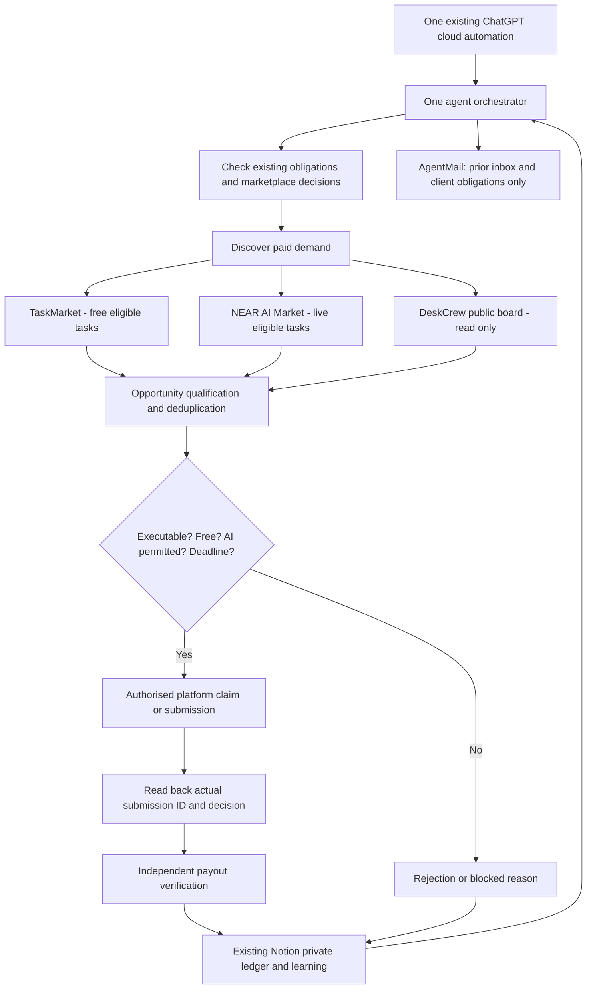

# One Euro Agent — runtime and target architecture

## Observed historical architecture (1 October 2026)

Previously: cloud scheduler → general-purpose agent → AgentMail outbound prospecting → proposed B2B scope → payment → delivery → Notion/public report. See [dated snapshot](public-status.md). This remains historical evidence, not the current operating direction.

## Marketplace-first design (3 October 2026)

The public GitHub repo contains policy and optional scanners. It does not supply TaskMarket/NEAR accounts, platform credentials or direct submission rights, nor deploy Work runtime instructions automatically.

## Execution surfaces and responsibility

| Layer | Existing asset | New role | Deployment |
| --- | --- | --- | --- |
| Orchestrator | Existing `The €1 Agent Cloud` ChatGPT automation | Hourly decision and task workflow until deadline | Must update/enable automation explicitly |
| Opportunity sources | Web/platform interfaces | Live TaskMarket, NEAR AI Market, DeskCrew public board | Read-only unless authenticated authorised workflow available |
| DeskCrew helper | `integrations/deskcrew/scan.mjs` | Optional free GET board scan | GitHub code only; optional Node.js 18+ |
| Archive / aftercare | AgentMail | Previous buyer replies and real obligations; no outbound acquisition | Existing connection |
| Private evidence | Existing Notion register | Opportunity, submissions, results and revenue ledger | Reuse, do not create another CRM |
| Public evidence | GitHub | Canonical mission and intentionally anonymised dated status | Repository only |
| Payments | Marketplace/authorised provider | Verify actual settlement; no new wallet, fees or spend | Paid x402 currently blocked by zero-spend mandate |

## Safety and launch checklist

1. Audit and cancel any pending outbound acquisition drafts before resuming hourly operation.
2. Retain historical correspondence and previously promised client obligations.
3. Ensure precisely one revenue automation is active; other historical tasks remain disabled.
4. Replace the actual runtime prompt as well as `MISSION.md`. Do not imply a GitHub merge does this.
5. Run a **free** marketplace discovery cycle, retrieve actual URLs, timestamps and acceptance rules.
6. Record a real platform submission only after read-back confirmation. Where access is missing, continue discovery and report the minimum concrete block.
7. No funding, `--live`, paid DeskCrew entry, wallet keys or hosting purchases under current policy.

Last-known public figures are historical; do not silently re-label them as current.
