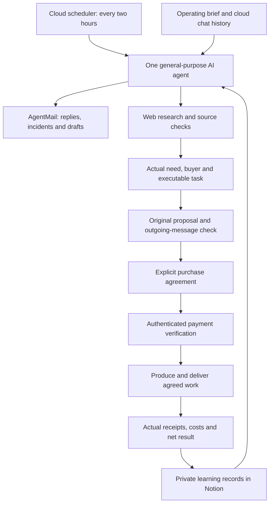

# Current structure

This describes the actual experiment as observed on 1 October 2026. It is not a standalone software deployment.

## Observed operational capability

- The cloud scheduler has executed runs.
- Web research and AgentMail reading, sending and draft management have been exercised.
- One batch of 10 new prospects was completed from 15:00:39 to 15:14:52 Europe/Paris on 1 October: 14 minutes 13 seconds.
- Private Notion learning records have received outreach records. This does not demonstrate automatic learning or better conversion.
- Three valid follow-ups remained scheduled at the latest checked queue.

## Unproven or incomplete stages

- A sourced need does not demonstrate a purchase decision.
- An outgoing message marked sent does not establish inbox delivery, reading or interest.
- No Microbuild purchase or receipt was confirmed at the dated public snapshot.
- Payment-provider account reads work, but creation of the experiment's checkout objects failed at the last permission test. No verified experiment-specific payment link is claimed.
- Paid production, delivery and reconciliation have not been demonstrated end to end.

The runtime depends on separately authorised cloud tools and services. Public files do not contain the private connections or launch the scheduler. Local copies of internal notes are not runtime dependencies.
